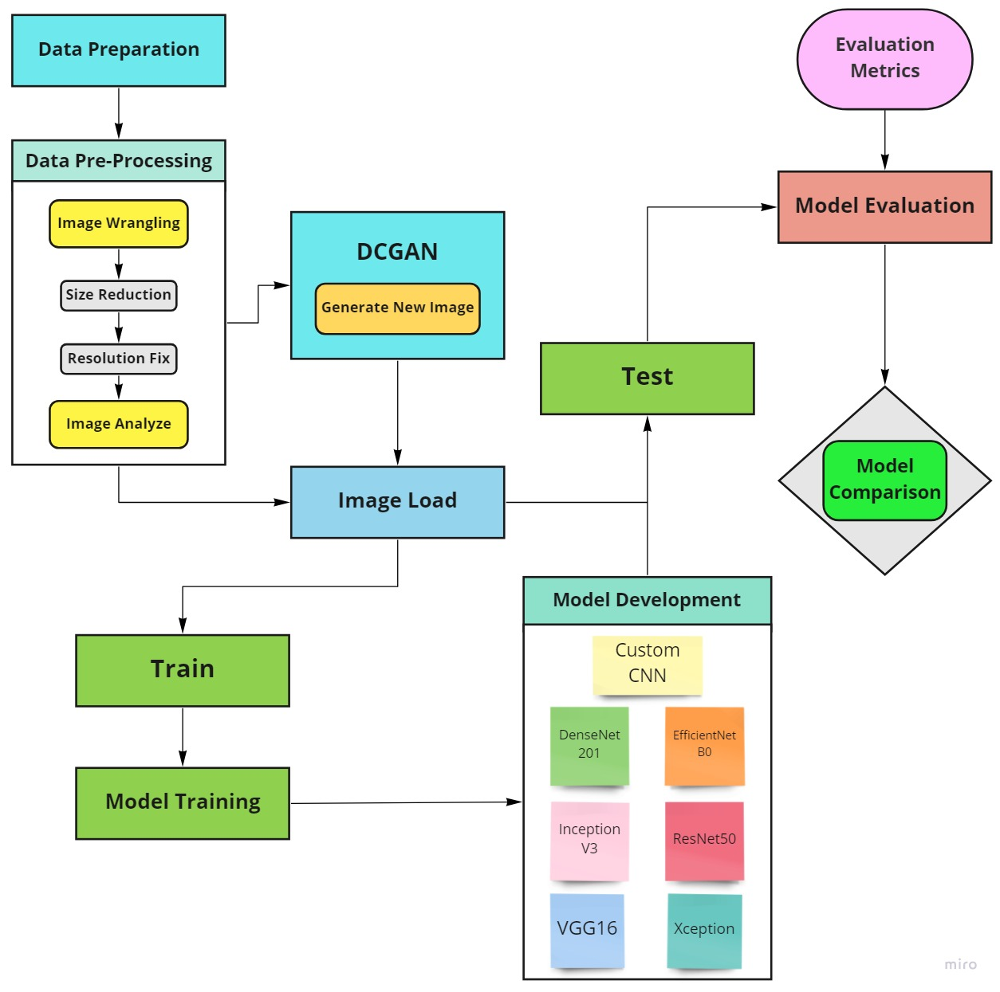
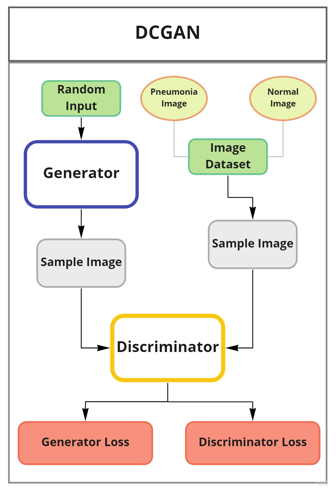

**Workflow diagram is illustrated below :**

# Medical-Image-Classification-Employing-DCGAN-and-CNN-Transfer-Learning-Techniques
A research of X-ray image classification to detect disease using deep learning techniques.
Dataset link- https://www.kaggle.com/paultimothymooney/chest-xray-pneumonia/code

## *1. Methodology* ##

**Workflow diagram and DCGAN Architecture:**

